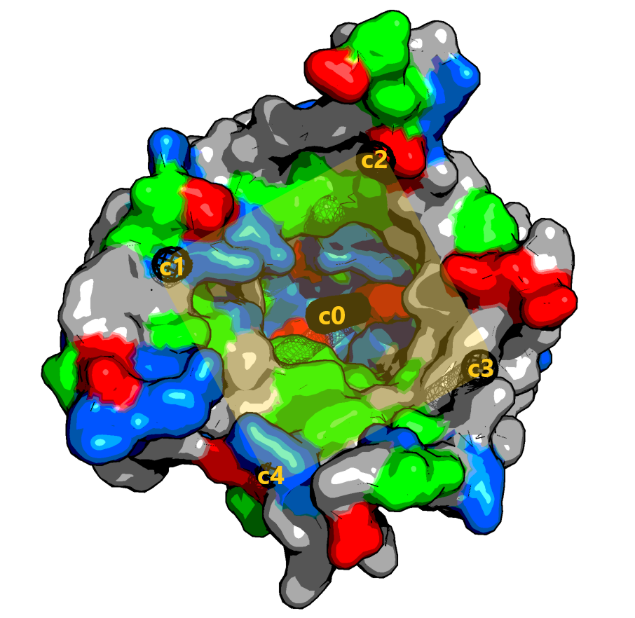

# Konbi-Mod
Konbi-Mod permet de trouver une combinaison de modes normaux qui satisfait une contrainte, par exemple d'augmenter la surface accessible au solvant d'une cavité, d'ouvrir un canal, ou bien d'augmenter la distance entre certains atomes.

Ce programme à été écrit dans le cadre d'un projet encadré par un professeur à l'université paris diderot, et à été développé en python 3.8.

# Prérequis
	-python3 ou supérieur

	-GNU Compiler Collection gcc

	-module python mdtraj: https://mdtraj.org/1.9.4/installation.html
		$ conda install -c conda-forge mdtraj

	-module python nma : https://github.com/mdtraj/nma
		$ git clone https://github.com/mdtraj/nma.git && cd nma
		$ python setup.py install

	-module python networkx : https://networkx.org
		$ conda install networkx
	
	-module python freesasa : https://github.com/freesasa/freesasa-python
		$ pip install freesasa

# Utilisation

		$python ./src/Konbi-Mod.py configuration.txt

## Fichiers et répertoires

Konbi_Mod nécessite un fichier de configuration en entrée pour fonctionner. Un exemple de ce fichier est donné dans ce répertoire. Konbi-Mod nécessite aussi un répertoire qui contient ./src ./Struct ./Modes.\newline
Dans le fichier de configuration vous pouvez indiquer si vous voulez que le script calcule les modes de basses fréquences avec :

		GenerateVectors=YES  

Une fois calculés pour un système donné pensez, pour gagner du temps, à indiquer dans le fichier de configuration:  

		GenerateVectors=NO  

Les vecteurs et valeurs propres calculés seront stockés dans un fichier primaire brut dans le répertoire Modes, sous le nom EigenVectorPDB.txt avec PDB le nom du fichier pdb sur lequel vous calculez les modes.  Un fichier secondaire contenant les modes de collectivité supérieure à un seuil sera créé à partir de EigenVectorPDB.txt, formaté différemment.  
Vous pouvez ensuite indiquer dans le fichier de configuration le chemin vers le fichier primaire avec:  

		EigenFile=./Modes/EignenVectorPDB.txt  

et vers le secondaire avec:  

		ModesFile=./Modes/ModesBassesFrequencesPDB.txt  

Pour une run avec le même seuil de collecivité, seul le fichier ModesBassesFrequencesPDB.txt est nécessaire, pour des runs avec un seuil de collectivité différent, il est nécessaire de le générer à nouveau à partir du fichier primaire, pour cela indiquez  

		ModesFile=NONE

Le reste du fichier de configuration permet d'indiquer au programme les éléments suivants:  

-Le chemin vers le fichier pdb sur lequel on désire travailler  

		PathToPdbFile=./Struct/PDB.pdb  

-Le nom du répertoire ou le programme écrira EignenVectorPDB.txt et ModesBassesFrequencesPDB.txt  

		FolderVectors=Modes  

-Le chemin vers l'axe de symétrie de la protéine (Voir Contraintes Volume)  

		PathToAxis=./Struct/Axis/Axis_PDB.txt  

## Contraintes

Les contraintes sont définies selon les critères Type, Selection et Contrainte.
Type spécifie le type de contrainte voulue: Distance, Volume ou Surface... à indiquer après Type=.
Selection défini sur quoi on applique cette contrainte, cela peut être des atomes ou des résidus.
Contrainte donne le ratio d'augmentation ou de diminution désiré. Par exemple :
		
		Type=Distance
		Selection=[[1,10]]
		Contrainte=1.5

L'exemple ci dessus impose une augmentation de distance de 50% entre les atomes 1 et 10.

### Contrainte de distance

Vous pouvez imposer une contrainte de distance entre une ou plusieurs paires d'atomes. Par exemple:
		
		Type=Distance		
		Selection=[[647,1691],[34,1002]]
		Contrainte=1.05 

Dans l'exemple ci dessus, la contrainte est une augmentation de 5% des distances entre les paires d'atomes 647-1691 et 34-1002. 
Pour une contrainte de distance entre  atomes, indiquez selon le format ci dessus la liste de paires de numéros d'atomes. 
Les numéros doivent correspondre à ceux du fichier pdb de départ. 
La liste doit respecter ce format, c'est à dire une liste de listes, même avec une seule paire d'atomes ([[647,1691]] une seule paire, double crochets).

### Contrainte de surface

Vous pouvez imposer une contrainte sur la surface accessible au solvant d'un ensemble de résidus. Par exemple:

		Type=Surface
		Selection=sel, resn 366-403  
		Contrainte=0.85

Dans l'exemple ci dessus, la contrainte est une diminution de 15% de l'accessibilté au solvant des résidus 366 à 403.
Pour une contrainte d'accessibilité au solvant, indiquez selon le format ci dessus la liste de résidus, la syntaxe complète est disponible ici: https://freesasa.github.io/1.1/Selection.html.
Les numéros de résidus doivent correspondre à ceux du fichier pdb de départ.

### Contrainte de volume

Les contraintes de type volume ne sont possibles que sur des protéines comportant un canal, et dont la longueur du canal est supérieur au diamètre de la protéine. Si la protéine est plus large que profonde ou asymétrique mais qu'elle comporte un canal, il vous faudra identifier son axe de symétrie et l'écrire dans un fichier et l'indiquer après la variable  PathToAxis= dans le fichier de configuration. Ce fichier est formaté de cette manière:

	coordonnée_xD
	coordonnée_yD
	coordonnée_zD
	#
	coordonnée_xA
	coordonnée_yA
	coordonnée_zA
	#
	H=largeure_du_pavé_droit

et un exemple :

	60.301
	16.909
	3.6685
	#
	83.901
	27.103
	52.311
	#
	H=3.062948557176583

Un axe est défini par deux points dans l'espace 3D. Le volume est construit à partir de l'axe qui définira sa profondeur, et d'une hauteur H qui définira son épaisseur. Le volume est un pavé droit, il est préférable que son épaisseur soit supérieure au diamètre du canal. Idéalement le pavé droit doit contenir le volume vide du canal et la partie interne de la protéine le long du canal, de sorte à ce qu'il ne contienne pas le canal entièrement, ni ne soit contenu par la partie vide du canal.  

Konbi-Mod lit le fichier axe et créé une représentation graphique du volume dans ./Struct/OBB.pdb. Vous pouvez charger OBB.pdb et votre sutructure pour vérifier si l'axe est correct, vous pouvez toujours modifier le fichire Axis pour faire des ajustements.

Si la protéine repsecte les condition énoncées plus haut, l'axe sera calculé automatiquement et savegardé dans un fichier Axis_nom_pdb.txt dans ./Struct/Axis/ .

Vous pouvez imposer une contrainte sur le volume d'un canal. Par exemple:

		Type=Volume
		Selection= 
		Contrainte=1.3

Ici on impose une augmentation de 30% du volume du canal de la protéine.
Aucune selection n'est nécessaire pour un calcul sur le volume.

### Autres paramètres

-Le seuil de collectivité de mouvements des modes lors de l'étape de filtrage des vecteurs propres:  

		Collectivity=0.25  

Ici on ne garde que les modes qui ont une collectivité supérieure à 0.25.
Ces modes seront sauvegardés dans le fichier ModesBasseFrequenceNomPDB.txt 

-La température en Kelvin pour le calcul d'amplitude des modes:  

		Temperature=300  

-Le nombre d'itération lors de l'optimisation:  

		Nombre_iterations=500  

Dans le fichier de config les # sont des lignes commentaires. L'ordre des elements n'a pas d'importance.

### *Astuce* 

Pour un fichier pdb donné, faites une première run avec vos paramètres de collectivité, de température et les paramètres par défaut (dans configTemplate.txt) et spécifiez uniquement GenerateVectors=YES. Après la génération des deux fichiers, indiquez GenerateVectors=NO et spécifiez l'emplacement de vos deux fichiers de vecteurs propres. Vous pouvez ensuite essayer différents types de contraintes, de sélection, d'itération et de température.

Pour les scripts de Konbi-Mod contenant un main, vous pouvez voir la doc ainsi:

		$python ./src/Script.py help

# Sortie

## Fichiers de sauvegarde des vecteurs propres

Konbi-Mod génère en premier lieu un fichiers contenant les vecteurs propres et valeurs propres calculés sur le système cible. Ce fichier est dit fichier primaire et inclus 50 modes de basses fréquences. Ce fichier est généré par nma.py et aura le nom EigenVectorNomPDB.txt.  
Ensuite un fichier secondaire de modes est généré par anime.py sous le nom ModesBassesFrequencesNomPDB.txt. Ce fichier comporte les modes de basses fréquences filtrés au dessus du seuil de collectivité indiqué dans le fichier de configuration. Pour chaque mode, avant le vecteur sont indiqués : un indice allant de 0 à n, la valeur propre, la fréquence, l'amplitude et la collectivité. Ensuite chaque coordonée du vecteur est indiquée comme dans le fichier primaire.
Ces deux fichiers sont stockés dans le répertoire ./Modes.

## Fichier spécifiques a Type=Volume

Si la contrainte choisie est Type=Volume pour une protéine à canal, Konbi-Mod va générer un axe de symétrie qui va passer le long de ce canal. Cet axe sera écrit dans un fichier situé dans le répertoire ./Struct/Axis. Ensuite le pavé droit sera écrit dans un fichier dans ./Struct sous le nom OBB.pdb. Sa position pourra être visualisée en le chargeant avec la structure de la protéine dans un logiciel de visualisation moléculaire.   

## Fichier de trajectoire et poids dans ./out

Après l'optimisation un fichier au format pdb contenant la trajectoire selon la combinaison de modes la plus favorable par rapport à la contrainte donnée sera généré.

Un fichier Weights.txt fait un récapitulatif des poids attribués au modes à chacune des étapes de l'optimisation ou la contrainte à été dépassée (notifiée sur le terminal). La dernière etape correspond aux poids donnés aux modes qui ont produit la trajectoire la plus favorable.

# Exemple

		$python ./src/Konbi-Mod.py ./Exemples/configuration3pgk.txt

La protéine 3pgk à deux domaines articulés autour d'une charnière. Les déplacements le long de ses modes sont amples et c'est un modèle idéal pour éprouver Konbi-Mod. La contrainte définie est une augmentation de la surface accessible au solvant de 20% des acides aminés 366 à 403 qui constituent la région  charnière de la protéine.

# Recouvrement

Si vous disposez de deux états conformationnels d'une protéine, vous pouvez utiliser le script Overlap.py pour calculer le recouvrement de certains modes.

	$python ./src/Overlap.py ./Struct/EtatConformationnel1.pdb ./Struct/EtatConformationnel2.pdb ./Modes/MesModes.txt format

./Struct/EtatConformationnel1.pdb et ./Struct/EtatConformationnel2.pdb sont vos deux états conformationnels.

./Modes/MesModes.txt est un fichier contenant les modes. Peut être le fichier primaire ou le secondaire.

format est une variable qui indique le type de fichier de modes que vous avez fourni. 'p' pour primaire et 's' pour secondaire.
